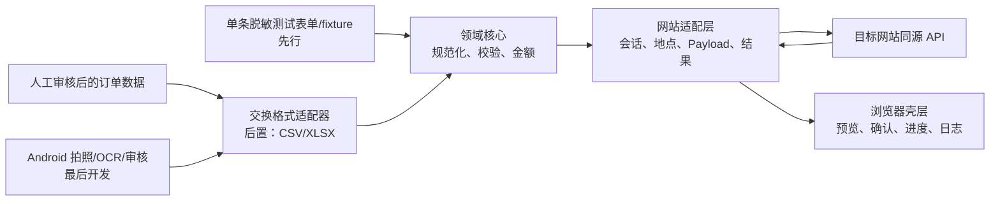

# 物流托运单自动化项目计划（动态蓝图）

> 文档状态：方案复核稿，等待业务负责人确认；尚未授权进入大规模实现  
> 当前版本：0.1.3  
> 最后更新：2026-08-14  
> 维护原则：本文件是可持续更新的设计基线，不是不可修改的固定规格。

## 0. 文档定位与事实优先级

本计划基于以下本地材料形成：

- `D:\Goings\Downloads\CODEX_HANDOFF_LOGISTICS_AUTOMATION.md`：前期讨论、观察结论与初步方案的汇总，只作为背景输入。
- `Har/t800.chemanman.com.har`
- `Har/t800.chemanman01.com.har`
- `Har/t800.chemanman02.com.har`
- `Har/t800.chemanman03.com.har`：当前登录会话下的到站联想操作，仅含两次联想请求及浏览器日志请求。
- `Har/05-save-success.har`：当前登录会话下一条虚构测试订单的成功保存序列；包含地点/客户联想、货号、保存、订单列表与保存后详情读取。
- `Har/04-init.har`：当前登录会话下刷新创建运单页的初始化序列；包含 `co`、全局信息与当前用户信息请求。

发生冲突时，按以下优先级决策：

1. 最新、完整、可复核的真实 Network 请求与对应页面行为；
2. 业务负责人明确确认的业务规则和会计含义；
3. 本计划中已经通过验收的设计决策；
4. 交接草案中的描述、经验判断和暂定方案。

任何未被前两类证据覆盖的信息不得为赶进度而猜测或硬编码。它必须登记为“待验证项”，并在取得最小必要 Network 证据后更新本文件、脱敏契约样本与测试。

### 0.1 证据等级

| 等级 | 含义 | 可以支持的决策 |
|---|---|---|
| E1 | 可在当前本地 HAR 中直接复核的请求、响应或字段结构 | 可以进入适配器契约测试，但仍须在当前账号/页面版本做一次在线复验 |
| E2 | 交接草案称已通过真实操作验证，但当前证据包中没有相应请求，或只有不完整片段 | 只能作为高优先级复验线索，不能作为批量开单依据 |
| H | 推测、经验判断、暂定设计或从单一样本外推 | 不得直接进入生产保存逻辑 |
| D | 本计划提出的工程决策 | 可随新证据调整，并须记录变更原因 |

## 1. 可行性结论与推荐方向

### 1.1 结论

项目在技术上具有较高可行性，但目前只足以进入“接口契约验证 + 单条最小闭环”阶段，不足以直接开发完整手机端、表格导入和批量开单系统。

已确认网站使用同源 HTTP 接口完成订单初始化、地点联想、付款方式读取、货号生成和订单保存；成功保存请求使用结构化 JSON 包装在表单字段中，因此不需要坐标点击式 RPA。浏览器内的轻量脚本继续是首选承载方式，因为它可以复用当前已登录会话，无需另建后端或保存 Cookie。

当前最大的不确定性不是“能否发请求”，而是以下契约和业务语义尚不完整：

- 保存请求在现有样本中有 127、132 与 134 个顶层字段，而初始化响应中的 `order_data` 只有约 31 个顶层字段；不能假设“初始化数据加少量覆盖”天然足够，也不能把某一份完整请求当成永久模板。
- 已提供的成功保存样本覆盖“送货 + 现付”及“自提 + 现付 + 新客户 ID 为 0”；尚未覆盖到付成功、欠付、回付、返款组合与空可选字段等全部分支。
- 已捕获 `HTTP 200 + errno=320 + 是否继续保存运单？`，但没有捕获用户确认后的后续请求，说明保存状态机尚未闭合。
- 保存接口是否幂等、超时后如何核对是否已经成功均未知。盲目重试会造成重复运单。

### 1.2 推荐的最简稳健架构

V1 不建设服务器，不先建设手机端，也不先接 Excel。先建立四个边界清晰的层：

1. **领域核心**：标准订单模型、规范化、校验、金额计算；全部为可单元测试的纯逻辑。
2. **网站适配层**：动态会话上下文、地点解析、网站 Payload 组装、保存结果分类；所有网站私有字段集中在这里。
3. **浏览器壳层**：只负责在指定域名/页面显示单条测试面板、明确确认和结果反馈。
4. **交换格式适配层（后置）**：核心链路验证后，再增加 CSV/XLSX 读写；手机端只依赖版本化交换契约，不感知网站 Payload。

第一条端到端链路应使用一条脱敏、人工填写的开发夹具或最小表单，而不是 Excel 或 OCR：

```text
单条脱敏 OrderDraft
  → 规范化与本地校验
  → 初始化订单/解析会话上下文
  → 解析唯一到站
  → 生成并预览网站 Payload 摘要
  → 操作员明确确认
  → 保存一次
  → 按应用层状态分类
  → 人工在网站中核对结果
```

## 2. 项目目标与边界

### 2.1 项目目标

- 降低纸质托运单重复录入网站的时间和错误率。
- 先稳定完成一条经人工审核的订单创建，再安全扩展至串行批量。
- 对每条导入记录提供可追溯、可恢复、可解释的结果。
- 将业务模型与网站内部字段隔离，使网站变化尽量只影响适配层、配置和契约测试。
- 不绕过登录、权限、业务确认或风控，不存储会话凭证。

### 2.2 V1 目标边界

V1 最终可包含：

- 单货物明细、单到站、单付款方式的订单。
- 业务负责人确认的必要字段和少量可选字段。
- 本地 CSV/XLSX 导入、预检、人工开始、默认串行保存。
- 成功、业务拒绝、需要人工决策、会话失效、网络不确定等状态的明确区分。
- 批次日志、失败行导出以及有条件的人工重试。

### 2.3 当前明确不做

- 未验证单条保存前，不做 Android/OCR、Excel 完整 UI 或批量执行器。
- 不做坐标点击、模拟键鼠、验证码绕过或登录自动化。
- 不建设云端中转服务、账号系统、远程数据库或手机与电脑实时同步。
- 不支持多货物行、多到站、组合付款、月结等未经确认的复杂分支。
- 不按姓名盲选历史客户，不对相似到站盲选第一个候选。
- 不在代码、配置、日志、测试夹具或表格中保存 Cookie、Token、真实个人信息。
- 不承诺目标网站私有 API 长期稳定；通过适配器和版本化证据降低变化成本。

## 3. 当前已确认事实（E1）

以下结论可从当前三个 HAR 中直接复核，但上线前仍需在当前网站版本复验。

### 3.1 接口和传输

| 事实 | 证据摘要 | 设计影响 |
|---|---|---|
| 存在订单初始化接口 `POST /api/Order/Order/co` | 04 HAR 捕获到 `errno=0`；请求 `req` 含 `order_tp_id/is_merge/co_mode`，响应含 `order_data`、多类 setting/enum 与 `logid`；`res.logid` 与请求 `logid` 相等 | 动态订单号、发站和账号上下文应从实时响应取得 |
| 当前登录上下文可读取 | 04 HAR 的 `globalInfo` 响应含用户、公司、集团、权限及设置等区块；`userInfo` 响应含 `group_id/company_id` | 适配器可把全局/用户信息作为上下文字段的候选来源，但不得把具体 ID 固化为配置 |
| 存在地点联想接口 `POST /api/Basic/Nsug/sug/` | 响应含 `count/info/pois`，候选含行政区、adcode、经纬度等字段；当前会话的 03 HAR 中，完整输入“通海县”得到 10 个候选且仅 1 个名称精确匹配 | 到站必须经过解析与消歧，不能只保存文本 |
| 存在客户联想接口 `corSug/ceeSug` | 两类接口均返回候选数组 | 可作为后续优化，但姓名并非安全唯一键 |
| 存在付款枚举接口 `POST /api/Order/Order/getPayMode` | 当前枚举含 `pay_billing`、`pay_arrival`、`pay_owed`、`pay_receipt` 等九类代码 | 枚举存在不等于每类保存字段语义均已验证 |
| 存在货号接口 `POST /api/Order/Order/getGoodsNum` | 成功响应含 `goods_num/goods_seq_num` | 是否为保存硬前置仍待验证 |
| 保存使用 `POST /api/Order/Order/coHandle` | Query 含 `btn_type/co_logid/logid/gid`；Body 为 `application/x-www-form-urlencoded`，字段含 `req` 与 `from`；05 HAR 成功保存的 Payload 含 127 个顶层字段 | API Client 必须按网页实际编码，不发送自创 JSON Content-Type；Builder 必须容忍经验证分支间的字段差异 |
| 保存结果不能只看 HTTP 状态 | 两份请求均 HTTP 200；一份 `errno=0/保存成功`，一份 `errno=320/是否继续保存运单？` | 建立应用层结果状态机 |
| 保存成功后存在详情读取 `POST /api/Order/Order/oinfo/` | 05 HAR 请求体使用 `od_link_id/od_basic_id`；响应 `errno=0`，含 `order_data`、费用、运输、签收、配置等完整详情区块 | 可作为已取得保存响应后的详情核对；不能单独解决响应丢失，因为所需 ID 来自成功响应 |
| 当前 API 请求与页面同源 | 保存请求目标为 `t800.chemanman.com` | 浏览器内脚本可优先尝试原生同源请求；仍须验证 Userscript 沙箱边界 |

### 3.2 已观察的 Payload 结构

- 已有成功保存样本直接确认 `pure_delivery/site_door`（送货）和 `self_pick/site_site`（自提）两种映射。
- 05 HAR 直接确认 `pay_billing`、`pay_billing_paid=true` 的成功保存；`pay_arrival` 已有确认分支样本，但尚缺成功保存样本；其他付款代码只在枚举中出现。
- 一份样本含非零 `cashreturn` 且 `cashreturn_paid=true`；另一份含非零 `discount`。两个样本的净额关系均符合“总额减返款”，但没有现返与欠返同时存在的样本。
- 05 HAR 直接确认一条成功保存中 `cor_id=0`、`cee_id=0`、`cee_customer_no=""`；但保存是否自动创建或污染客户档案仍未核对。
- `goods`、顶层汇总和 `point_trans_goods` 的重复字段确实存在。
- `goods` 内的件数、重量、体积在不同样本中出现字符串或数值的差异，而顶层/中转汇总多为数值；类型必须按真实契约建立测试，不能依赖 JavaScript 隐式转换。
- 保存中的 `arr_info` 与 `point_trans_arr` 具有相同的结构化地点字段；联想响应的原始 `pois` 字段名与最终保存对象并不完全相同，说明中间还有页面转换规则需要固化。
- 当前地点联想请求的 `req` 中同时含 `start_pid`、`group_id`、`company_id`、`department_id`、`user_id` 等上下文字段；它们的实时来源仍未通过初始化 HAR 闭合，不能从 03 HAR 的具体值硬编码。
- 成功响应的 `res` 含 `order_data`；当前样本可见下一步信息，但所有必须读取的字段仍需列出契约。
- `co_logid` 与 `logid` 在保存请求中不是同一个值；二者来源不能混用。
- 成功响应的 `order_data` 含 `od_basic_id`、`od_link_id`、`order_num`、`next_order_num` 等字段；后续 `oinfo` 正是使用其中前两个 ID。
- 当前初始化 `order_data` 含 31 个顶层字段，其中可直接确认 `order_num`、`billing_date`、`start_info`、`start_point`、`mgr_id`、`goods_num`；它不足以单独生成保存 Payload 的全部字段。

### 3.3 当前证据资产的安全事实

现有 HAR 中可检测到多处类似手机号的内容，并包含客户、订单和内部账号字段。即便浏览器导出时未包含显式 Cookie Header，HAR 仍属于敏感业务材料：

- `Har/` 及压缩包不得提交到公开或普通源码仓库。
- 初始化仓库前应先通过 `.gitignore` 排除原始 HAR、截图、导入文件、导出结果和本地日志。
- 测试只能使用人工脱敏后的最小契约夹具；不得直接复制完整请求/响应。
- 后续证据应保存在受控位置，源码仓库只保留字段结构、掩码值和必要的契约摘要。

## 4. 尚未被当前证据包证实的内容

### 4.1 文档报告为已验证、但当前只能列为 E2

- 收货手机、包装、重量、体积等字段为空时，当前账号配置下仍可保存。
- 欠付、回付的完整保存 Payload 和 paid flag 规则。
- 发站固定昆明在所有实际操作账号、网点和页面入口中都成立。
- 纸质单上的“提付”在业务和财务上总是等价于网站“到付”。

### 4.2 当前为 H 的关键假设

- `getGoodsNum` 是否为保存硬前置，或只是页面展示功能。
- `errno=320` 后继续保存需要增加哪个 Query/Body 字段，是否会改变订单号。
- 保存超时后以相同 `order_num` 重试会被拒绝、去重，还是生成重复订单。
- 所有动态值都可以仅从初始化响应取得；当前已知 `co_logid` 与 `logid` 不同。
- 用户脚本环境中的原生 `fetch`、Cookie 附带、页面 CSP 和框架路由变化能长期稳定工作。
- “精确名称匹配”足以唯一确定客户或地点。
- 手机端导出的“来源图片路径”能在电脑端解析；Android URI 通常不可跨设备直接使用，因此当前设计不能依赖它。
- 第三方 OCR/AI 的准确率、成本、数据驻留、保留策略和网络条件符合业务要求。

## 5. 待验证清单与最小抓取要求

每次抓取都应：打开 DevTools Network、勾选 Preserve log、清空旧请求、只完成一个明确动作、导出前脱敏；不要截取整段无关会话。必须保留该动作的初始化请求、依赖查询、保存请求、响应和页面最终结果。

| ID | 优先级 | 待验证项 | 最小操作与需保留信息 | 通过标准 |
|---|---:|---|---|---|
| V-001 | P0 | 最小现付单完整闭环 | 新开单页面；一条虚构“送货+现付+无返款”订单；保留 `co`、地点选择、可选货号、`coHandle` 及页面结果 | 能解释动态参数来源、完整请求字段和成功响应，网站中仅出现一单 |
| V-002 | P0 | `errno=320` 决策分支 | 对会触发提示的虚构单，分别记录首次保存和点击“继续”后的紧邻请求；另记录取消行为 | 明确二次提交差异、是否复用订单号、最终状态；未确认前自动化只返回 `decision_required` |
| V-003 | P0 | 新客户 ID=0 | 使用绝不会命中历史客户的虚构姓名；记录联想无匹配、保存请求/响应，并在保存后检查客户档案副作用 | 确认能否保存、是否新建客户、必要空字段及后续清理方式 |
| V-004 | P0 | 动态参数来源 | 页面刷新、重新登录或切换网点各一次，只抓初始化和一次不提交的页面动作 | 确认 `gid/logid/co_logid/mgr_id/start_point/order_num` 的来源、生命周期和失效表现 |
| V-005 | P0 | 保存后的核对/去重能力 | 成功开一条虚构单后，记录网站按运单号查询/详情接口 | 能在响应丢失时用确定键查询订单，不靠再次保存猜测结果 |
| V-006 | P1 | 自提映射 | 一条“自提+现付”虚构单的完整请求/响应 | 复核 `delivery_mode/service_type` 及是否影响其他费用/地址字段 |
| V-007 | P1 | 付款分支 | 现付、到付、欠付、回付各一条最小虚构单，分别抓取，不混入返款 | 明确金额字段、空字段、paid flag、会计含义与响应 |
| V-008 | P1 | 返款组合 | 无返款、仅现返、仅欠返、两者同时存在四组；金额使用明显不同的小测试值 | 明确 `cashreturn/discount/actual_price` 与 paid flag；确认组合是否合法 |
| V-009 | P1 | 可选字段为空 | 包装、手机号、重量、体积分别为空的最小样本 | 明确空字符串、null、0 的网站行为和校验提示 |
| V-010 | P1 | 地点消歧 | 一个唯一地点和一个重名/多候选地点；保留搜索请求、候选及最终保存对象 | 定义精确匹配规则和人工选择所需最少字段 |
| V-011 | P1 | 货号必要性 | 在页面正常流程与经过授权的测试探针中对比是否调用/使用 `getGoodsNum` | 未证实可省略前继续调用官网接口，不逆向算法 |
| V-012 | P1 | 客户匹配规则 | 同名客户、同名不同电话/到站的候选样本，保留脱敏结构 | 禁止仅按姓名自动绑定；形成可解释的复合匹配或决定 V1 永不自动绑定 |
| V-013 | P1 | 失败响应分类 | 会话过期、输入校验失败、服务器业务拒绝各一个最小样本 | 明确 HTTP、`errno/errmsg/res` 结构，日志不泄露 PII |
| V-014 | P2 | Userscript 运行边界 | 在目标浏览器安装最小只读探针，验证页面路由、同源 fetch、凭证附带和 CSP | 不读取/持久化凭证即可稳定调用只读初始化接口 |
| V-015 | P0 | 业务授权与测试环境 | 由业务负责人确认账号授权、允许的自动化范围、测试单撤销/作废流程和低峰限速 | 未确认不得执行批量真实保存 |

当前进展（2026-08-14）：

- V-001 现已取得独立的当前 `co` 初始化与成功保存样本，可进入纯 Builder/契约测试开发；`gid`、`co_logid` 的派生关系仍需在浏览器适配器实现前验证。
- V-003 已证实 `cor_id=0`、`cee_id=0`、空 `cee_customer_no` 的成功保存；仍需确认该操作对客户档案是否有自动创建或其他副作用。
- V-006 已证实自提映射为 `self_pick/site_site`；送货映射已有旧成功样本。仍需确认两种方式对各类费用/地址字段的完整影响。
- V-011 已证实正常成功流程调用 `getGoodsNum`，但尚未证实省略它是否仍能保存。
- V-005 发现保存后 `oinfo` 详情接口，但它依赖成功响应中的内部 ID；仍需找到可由预先已知订单号执行的查询路径，才能安全处理 `ambiguous` 状态。

## 6. 总体架构与边界设计



### 6.1 领域核心

只认识本项目的业务字段，不认识 `gid`、`logid`、`point_trans_*` 等网站内部字段。职责包括：

- 表格/表单原始值规范化。
- 必填、枚举、数值和跨字段校验。
- 金额使用整数分或明确的十进制定点类型计算，避免浮点误差。
- 生成稳定的本地 `source_record_id` 和内容指纹，辅助追踪与重复检测。
- 输出结构化问题列表，不弹 UI、不发网络请求。

### 6.2 网站适配层

网站变化只应集中影响该层。职责包括：

- 读取实时初始化数据和动态上下文。
- 将地点候选转换为经过确认的 `ResolvedStation`。
- 按适配器版本将业务订单组装为完整 Payload。
- 使用正确的 form-urlencoded 传输格式。
- 把 HTTP/JSON/业务码转换为稳定的 `SaveOutcome`。
- 在发出保存前生成不含 PII 的结构摘要和关键不变量校验结果。

保存 Payload 不应简单复制某份真实请求，也不能假定初始化响应已包含全部字段。当前证据显示保存比初始化 `order_data` 多约 111～113 个字段。阶段 0 必须将每个额外字段分类为：

- 来自实时初始化/会话；
- 来自业务输入；
- 由确定规则派生；
- 网站静态默认值；
- 未知，必须验证。

只有前三类和已由多个基线样本确认的静态默认值可以进入 Builder。未知字段不得从真实 HAR 连同客户或会话数据照搬。

### 6.3 浏览器壳层

- 精确限制运行域名和页面路径，默认最小权限。
- DOM 只承载入口、预览、人工确认、进度和结果；不把页面表单 DOM 当成业务数据源。
- 用户必须先看到规范化摘要、到站解析结果、订单号和可能影响财务的字段，再明确提交。
- 不显示或记录原始 Cookie/Token，不把完整请求体写入控制台。
- 页面版本不兼容或初始化契约变化时 fail closed：停止保存并提示采集最小证据。

### 6.4 手机端与交换格式边界

手机端永远输出版本化的领域数据，不输出网站 Payload。内部权威格式建议为 JSON 结构；CSV/XLSX 只是序列化适配器。

- 先定义 `schema_version`、`batch_id`、`source_record_id` 和字段语义，再决定文件列头。
- 手机号、运单号、来源编号按字符串处理，避免 Excel 科学计数法和前导零丢失。
- 金额在领域层用整数分或定点十进制，网站边界再转换为其所需类型。
- CSV 若启用，使用 UTF-8 BOM、明确转义和导入预览；导出时防止 `= + - @` 开头内容造成公式注入。
- `source_image` 不保存不可跨设备的 Android URI。V1 可使用不含路径的来源标签/哈希；若未来需要携带原图，应设计加密或受控的独立证据包。
- OCR 的原始输出、人工修订值、最终确认值应分离，只有最终确认值可以导出。

## 7. 模块划分与建议目录

技术栈在阶段 0 结束时确认；当前建议 TypeScript + 浏览器构建工具 + 单元测试框架，以获得类型约束和可测试纯函数。目录是可调整提案：

```text
docs/
  evidence/             # 只放脱敏证据说明和字段契约，不放原始 HAR
  decisions/            # 重要架构/业务决策记录
src/
  domain/
    order-draft.ts
    normalize.ts
    validate.ts
    money.ts
  contracts/
    exchange-schema.ts
    website-contract.ts
  adapters/
    chemanman/
      api-client.ts
      session-context.ts
      station-resolver.ts
      customer-resolver.ts
      payload-builder.ts
      save-outcome.ts
  application/
    create-one-order.ts
    batch-runner.ts       # 后置
    retry-policy.ts
  io/
    csv-reader.ts         # 后置
    xlsx-reader.ts        # 后置
    result-exporter.ts    # 后置
  userscript/
    bootstrap.ts
    single-order-panel.ts
    batch-panel.ts        # 后置
tests/
  fixtures/              # 仅脱敏、最小、版本化契约样本
  unit/
  contract/
```

`customer-resolver` 在 V1 可以完全禁用：如果 V-003 证明 ID=0 安全且不会产生不可接受的客户副作用，跳过客户联想比“按姓名精确匹配”更简单、更安全。若需要绑定历史客户，必须先完成 V-012，不以姓名作为唯一键。

## 8. 关键数据模型

### 8.1 `OrderDraft`（领域模型）

| 字段 | 类型/规则 | 说明 |
|---|---|---|
| `schema_version` | 非空字符串 | 交换契约版本 |
| `source_record_id` | 非空字符串 | 手机/人工录入侧生成的稳定记录 ID |
| `source_label` | 可空字符串 | 只用于人工追溯，不要求是文件路径 |
| `destination_text` | 非空字符串 | 原始到站文本，未经解析 |
| `delivery_type` | `pickup` / `delivery` | 未知值报错，不猜测 |
| `sender_name` | 非空字符串 | 不据此自动绑定客户 |
| `receiver_name` | 非空字符串 | 不据此自动绑定客户 |
| `receiver_mobile` | 可空字符串 | 不转数值，不擅自强制 11 位 |
| `goods_name` | 非空字符串 | V1 单货物行 |
| `quantity` | 正整数 | 不允许隐式截断 |
| `package` | 可空字符串 | 空值网站表示待验证 |
| `weight` / `volume` | 可空定点十进制 | 单位必须在契约中固定 |
| `freight_minor` | 非负整数 | 金额最小单位；显示/导入时转换 |
| `cash_return_minor` | 非负整数，默认 0 | 业务和 paid flag 待按样本确认 |
| `debt_return_minor` | 非负整数，默认 0 | 网站字段疑似 `discount`，组合待验证 |
| `payment_type` | 受支持领域枚举 | 与网站枚举通过适配器映射 |

规则：`freight - cash_return - debt_return` 不得为负；但公式只有在 V-008 验证后才允许作用于所有组合。

### 8.2 网站边界模型

- `SessionContext`：`gid`、`logid`、`co_logid`、当前网点/公司/操作员、发站、订单号、契约版本与获取时间。
- `ResolvedStation`：原输入、候选唯一键、展示值、行政区、adcode、网站地点对象以及解析依据。
- `ResolvedCustomer`：`new` 或 `existing`；若为 existing，必须含匹配依据和用户确认信息。
- `PayloadBuildReport`：生成的 Payload、来源分类、不变量检查、未知字段列表和脱敏摘要。
- `SaveOutcome`：见下列联合状态。

```text
success            已明确保存成功并取得网站订单标识
rejected           明确业务拒绝，不自动重试
decision_required  网站要求人工确认，例如 errno=320
auth_expired        登录/权限失效，停止队列
ambiguous           请求可能已到达，但未取得可靠结果；先核对，禁止盲重试
transport_failed    可证明请求未发出或只读请求失败
contract_changed    返回结构或关键字段不符合已验证契约，停止队列
```

### 8.3 批次模型（后置）

每条记录至少有 `pending/validating/resolving/ready/submitting/success/failed/decision_required/ambiguous/stopped` 状态、尝试次数、订单号、脱敏错误码和时间戳。不得在日志中保存完整 Payload、姓名、手机号或地点详细地址。

## 9. 网站接口适配策略

### 9.1 契约版本化

- 为网站适配器设独立版本，例如 `chemanman-contract-v1`。
- 每个 E1 接口保存一个最小脱敏请求/响应夹具和结构断言。
- 运行时校验关键字段、类型、枚举和应用层状态；不匹配即 `contract_changed`。
- 路径、参数名、业务码解释放在适配层，不散落到 UI、表格解析器或手机端。

### 9.2 动态上下文

- 每单先获取新初始化数据，默认不直接复用上一单的 `next_order_num`。
- 不缓存 `gid/logid/co_logid/mgr_id/start_point/order_num` 为静态配置。
- 会话或网点变化时，作废当前上下文并重新初始化。
- 只有经 V-004 证明生命周期一致的字段才可在一个短批次内复用。

### 9.3 地点解析

- 先做标准化搜索，再保留全部候选。
- 自动选择仅限一个可解释的唯一匹配；匹配键至少考虑展示值和行政区/adcode，不以数组第一项为默认。
- 多候选、零候选、接口结构变化均返回待人工处理。
- 允许建立业务确认过的站点别名配置，但配置中记录目标唯一键、验证日期和适配器版本。
- 缓存只保存非会话地点数据，并提供失效/重新验证机制。

### 9.4 客户策略

首选顺序：

1. 完成 V-003，若 ID=0 的业务副作用可接受，V1 默认按新对象保存，客户联想延后。
2. 若必须复用客户，完成 V-012 后使用复合条件，并在歧义时要求用户选择。
3. 绝不因同名自动绑定客户 ID；错误绑定比重复录入风险更高。

### 9.5 保存与去重

- 保存是有副作用操作，只能在预检通过且用户明确开始后执行。
- 默认串行；在幂等性、限速和动态订单号规则未证明前，不启用并发。
- 为每条领域记录计算本地指纹，用于提示同一批次/本地历史重复，但它不等同于服务端幂等键。
- `coHandle` 超时、断网或响应无法解析时标记 `ambiguous`，先通过 V-005 确定的查询接口核对订单号；不得立即重发。
- 只读初始化/地点查询可按退避策略重试；明确业务拒绝和确认分支不得自动重试。
- 若网站最终证明对同一订单号有可靠幂等保证，再通过决策记录放宽策略。

## 10. 风险、假设与缓解措施

| 风险 | 概率 | 影响 | 缓解/门禁 |
|---|---|---|---|
| 私有 API 或前端 Payload 变化 | 高 | 高 | 适配层隔离、契约版本、启动探针、fail closed、最小证据更新流程 |
| 保存响应丢失后重复开单 | 中 | 极高 | 禁止盲重试；先验证按订单号核对；串行和本地状态日志 |
| `errno=320` 等确认分支被当作失败或成功 | 已发生 | 高 | 建模 `decision_required`；完成 V-002 前不自动继续 |
| paid flag/返款含义错误影响财务 | 中 | 极高 | 每种付款和返款组合由业务人员核对网站结果；单独验收 |
| 客户同名导致错误绑定 | 高 | 高 | V1 优先不匹配；否则复合匹配+人工选择 |
| 到站重名或联想返回变化 | 高 | 高 | 行政区消歧、唯一匹配、别名配置、歧义阻断 |
| 动态参数失效或混用 | 中 | 高 | 每单初始化、字段来源追踪、契约断言，不持久化会话值 |
| 账号权限/网站政策不允许自动化 | 未知 | 极高 | V-015 为 P0 门禁，取得业务授权并限制速率和操作范围 |
| 原始 HAR、导入文件或日志泄露 PII | 高 | 高 | 原始证据不入库；脱敏夹具；日志最小化；保留周期和清除入口 |
| Userscript 隔离、CSP 或路由变化 | 中 | 中 | 先做只读探针；精确 `@match`；最小权限；必要时再评估浏览器扩展 |
| CSV/Excel 类型、编码、公式注入 | 中 | 中 | 版本化 Schema、预览、字符串字段、定点金额、UTF-8 BOM、导出转义 |
| 手机 OCR 误识金额/到站/手机号 | 高 | 高 | 手机端后置；置信度与规则仅提示；人工最终确认；不可猜测 |
| 第三方 AI 数据保留或跨境处理 | 未知 | 高 | 选型前做隐私评估；默认不上传；明确同意、保留与删除策略 |
| 网站负载或风控触发 | 中 | 高 | 串行、低峰、限速、暂停、停止；无授权不批量 |

## 11. 开发阶段与验收标准

### 阶段 0：证据与契约闭合（当前下一阶段）

目标：完成 P0 验证，证明单条保存状态机和动态字段来源。

工作：

- 先建立 `.gitignore` 和脱敏证据规范，再初始化源码结构。
- 完成 V-001～V-005、V-015。
- 从真实请求提取最小脱敏契约夹具；逐字段标注来源。
- 确认 TypeScript/Userscript 工具链与目标浏览器。
- 写一份“单条订单契约报告”，不做批量 UI。

验收：

- 所有 P0 待验证项均有证据或被明确列为阻塞。
- 能解释完整保存 Payload 中每个字段的来源类别；没有从真实 HAR 偷带 PII/会话值。
- 明确成功、拒绝、确认、登录失效、结果不确定五类行为。
- 业务负责人批准一条虚构测试单的创建与作废/清理流程。

### 阶段 1：纯领域核心与 Payload Builder

目标：在不发网络请求的情况下可靠转换一条订单。

工作：

- 定义 `OrderDraft`、规范化和校验。
- 实现金额、付款、送货方式、货物重复字段和地点对象组装。
- 以每个已验证场景建立脱敏 fixture、契约测试和负例。
- Builder 输出字段来源报告与关键不变量。

验收：

- 单元测试覆盖必填、枚举、空值、数值边界、金额不变量和未知输入。
- 已验证样本的 Payload 结构/类型与脱敏契约一致。
- 未验证付款、返款或客户分支无法被调用，返回清晰错误而非默认值。
- 核心代码不依赖 DOM、Excel 或手机端。

### 阶段 2：浏览器内单条订单最小闭环

目标：通过最小面板创建一条经批准的虚构订单。

工作：

- 实现初始化、地点解析、可选货号与保存 API Client。
- 添加预览、明确确认、一次提交和结果分类。
- 增加按订单号核对与结果不确定处理。
- 限定域名、页面和最小权限。

验收：

- 连续至少 3 次在授权环境中各创建一条且不重复。
- 每次网站页面结果、接口结果和本地结果一致。
- 模拟会话过期、地点歧义和响应不可解析时均停止保存并给出可操作提示。
- `errno=320` 不被自动确认，除非 V-002 后另经业务批准。

### 阶段 3：业务分支扩展

目标：逐个纳入经验证的常见业务组合。

顺序：

1. 自提/送货；
2. 现付/到付；
3. 欠付/回付；
4. 现返/欠返及组合；
5. 空可选字段；
6. 客户复用（只有确有业务价值时）。

验收：

- 每个分支都有独立 Network 证据、业务人员核对、脱敏 fixture 和回归测试。
- 3～10 条受控测试全部得到可解释终态，无重复单、错客户或错误金额。
- 新分支不改变旧分支契约测试结果。

### 阶段 4：交换格式与串行批量

目标：在核心链路稳定后接入本地文件和批次执行。

工作：

- 确认版本化 CSV/XLSX Schema，先只支持一种主格式，另一种作为后续兼容项。
- 实现整批预检、逐行解析、地点预解析、人工确认、串行执行、暂停/停止。
- 建立最小化本地批次日志、重复提示、失败/待确认导出。
- 明确刷新/崩溃后的恢复和 PII 清除策略。

验收：

- 错误文件、缺列、重复行、公式单元格、空值和非法数字均在发请求前阻断。
- 10 条授权测试中，一行失败不会让后续状态丢失；停止后不再发新保存请求。
- `ambiguous` 行不会自动重试；重启后的日志足以安全核对。
- 性能和请求频率满足业务授权；默认仍为串行。

### 阶段 5：Android OCR 与审核

进入条件：阶段 4 稳定，交换契约冻结一个兼容版本，OCR 提供方和隐私方案获批。

工作：拍照/选图、OCR、字段置信度、人工修订、异常筛选、版本化导出。手机端不调用网站 API，也不生成网站字段。

验收：

- 金额、到站、手机号、付款方式等高风险字段未经人工确认不能导出。
- OCR 不确定时返回空/待审核，不自动猜值。
- 导出文件通过桌面导入器契约测试；来源追溯不依赖跨设备本地路径。
- 有明确的图片/识别结果存储、上传、保留和删除说明。

### 阶段 6：可选优化

只有数据证明有必要时再评估低并发、站点缓存、手机直连同步、更多付款方式、多货物行或浏览器扩展。每项都需独立决策与回归门禁。

## 12. 测试策略

### 12.1 单元测试

- 文本规范化、中文业务枚举映射、空值和全半角处理。
- 件数/重量/体积/金额边界与定点计算。
- 付款字段互斥、送货方式映射和重复货物汇总字段。
- 日志脱敏、CSV 公式注入防护和本地指纹稳定性。

### 12.2 契约测试

- 针对每个接口的请求方法、路径、Query 名称、Content-Type、Body 编码和关键响应结构。
- 对 Payload 字段集合、关键类型和不变量做 snapshot/结构断言；避免 snapshot 包含真实值。
- 对未知 `errno`、缺少字段、JSON 非法和 HTML 登录页响应做 fail-closed 测试。

### 12.3 集成测试

- API Client 使用本地脱敏响应模拟成功、拒绝、确认、会话失效和超时。
- 只有在授权窗口才运行真实网站测试；一次只开一条虚构单并人工核对。
- 真实集成测试默认不进入常规 CI，不保存会话凭证。

### 12.4 端到端与回归矩阵

矩阵维度包括送货方式、付款方式、返款类型、可选字段空值、地点唯一/歧义、客户新建/复用和网站响应状态。采用逐维扩展而非一次覆盖笛卡尔积；高财务风险组合必须有独立样本。

## 13. 异常与失败处理

| 情况 | 行为 | 自动重试 |
|---|---|---|
| 本地校验失败 | 不发请求；定位字段和修正方式 | 否 |
| 地点无候选/多候选 | 标记待确认；显示行政区信息供选择 | 否 |
| 初始化/只读查询短暂网络失败 | 指数退避、有限次数、可取消 | 可以 |
| 登录失效/权限不足 | 停止整个队列，要求重新登录后重新预检 | 否 |
| 明确业务拒绝 | 记录业务码和脱敏原因；后续行可继续 | 否 |
| `decision_required` | 暂停该行；按已验证流程要求人工决策 | 否 |
| 保存超时/连接中断/非法响应 | 标记 `ambiguous`；先按订单号查询核对 | 否 |
| 契约变化 | 停止整个队列；记录缺失/新增字段摘要，要求新证据 | 否 |
| 用户停止 | 不启动新订单；等待当前明确终态或标为不确定 | 不适用 |

错误提示应回答三件事：发生在哪一步、当前是否可能已经开单、用户下一步应核对或抓取什么。不得只显示“失败”。

## 14. 安全与隐私

- 只在自有或明确授权账号中运行，遵守网站使用规则和操作限额。
- Userscript 精确限制主机与页面；不申请跨域、剪贴板或远程代码等非必要权限。
- 不在源码、localStorage、IndexedDB、控制台或导出结果中记录 Cookie、Token、完整请求体。
- 日志默认只保留本地记录 ID、行号、脱敏到站、网站订单号、状态码和时间；姓名/手机号按最小需要显示并提供清除。
- 原始 HAR、图片、导入文件和结果文件都可能含个人信息；定义访问权限、保留期限和安全删除流程。
- 测试夹具使用虚构姓名、保留格式的假手机号和无真实业务关系的金额。
- 使用第三方 OCR/AI 前，确认数据传输、驻留地区、训练使用、保留期限、删除能力和供应商合同；未经确认不上传真实单据。
- 若未来引入第三方 npm 库，固定版本、检查许可证和供应链风险；文件解析库在浏览器本地运行，不把数据发往 CDN。

## 15. 新网站信息的更新流程

每当页面、接口、字段或业务规则出现新情况：

1. 停止受影响分支的自动保存；不以临时默认值继续。
2. 为问题分配验证 ID，记录页面版本/时间、触发步骤、预期与实际结果。
3. 只抓取能重现该行为的最小 Network 序列，并在仓库外保存原始证据。
4. 提取脱敏请求/响应结构，标出新增、删除、类型变化和业务码。
5. 更新本文件的 E1/E2/H 分类、风险、模型或阶段门禁。
6. 更新适配器版本和契约 fixture；先让旧测试暴露差异，再实现局部修改。
7. 在授权环境用一条虚构单复验，业务人员核对页面和财务含义。
8. 在下方变更日志记录“证据 → 决策 → 影响 → 回滚方式”。

如新证据与本计划冲突，以新证据为准，但不能只改代码而不更新计划、测试和适配器版本。

## 16. 开始编码前的决策门禁

需要业务负责人确认：

- 账号和网站是否明确允许这种同源自动化，测试单如何作废/清理。
- V1 真实必填字段、金额单位，以及“提付/到付”“现返/欠返”的财务定义。
- 新客户 ID=0 是否允许，以及可能自动创建客户记录是否可接受。
- 到站歧义时由谁选择，是否有常用站点白名单。
- 导入结果和本地日志允许保留哪些个人信息、保留多久。
- 手机 OCR 供应商/隐私方案是否已有偏好；没有则保持后置。

技术门禁：V-001～V-005 和 V-015 未完成前，只允许编写纯函数、脱敏契约工具或只读探针，不实现可批量真实保存的功能。

## 17. 重要调整（相对交接草案）

1. **把手机端、Excel 和批量 UI 全部后置。** 首先用一条脱敏领域数据打通并核对单条订单。
2. **将“已验证”拆为 E1/E2。** 新客户 ID=0、自提、欠付/回付和多种空值目前没有被提供的 HAR 直接证实。
3. **不把初始化响应视为完整模板。** 保存 Payload 比初始化 `order_data` 多一百余字段，必须逐项建立来源和契约。
4. **取消保存接口的盲目网络重试。** 未证明幂等前，超时属于结果不确定；先按订单号核对，避免重复开单。
5. **把 `errno=320` 建模为人工决策状态。** 捕获后续请求之前不自动“继续保存”。
6. **客户联想从硬流程降为可选优化。** 当前已确认 ID=0 可成功保存，但尚未确认客户档案副作用；若复用客户，禁止姓名唯一匹配。
7. **交换格式与内部模型解耦。** 内部使用版本化领域 Schema；CSV/XLSX 只是适配器，来源图片改为可跨设备的记录标识而非手机本地路径。
8. **默认长期串行。** 只有幂等、订单号、限流和会话复用均验证后才讨论 2～5 并发。
9. **原始 HAR 作为敏感资产管理。** 当前项目中的 `Har/` 不能随未来仓库提交，必须先做忽略和脱敏流程。

## 18. 变更日志

| 日期 | 版本 | 变更 | 依据 | 影响 |
|---|---|---|---|---|
| 2026-08-14 | 0.1.0 | 初次系统复核并建立动态计划 | 交接草案 + 三份本地 HAR 结构核验 | 项目停留在方案确认/证据闭合阶段，不进入大规模实现 |
| 2026-08-14 | 0.1.1 | 增加当前会话地点联想复验结果 | `t800.chemanman03.com.har` | 证实当前页面联想接口仍可用；地点对象转换、动态上下文来源和保存链路仍为待验证项 |
| 2026-08-14 | 0.1.2 | 增加当前会话成功保存链路复验 | `05-save-success.har` | 直接确认新客户 ID=0、自提、现付、货号调用、保存后详情读取；动态初始化、确认分支、幂等/查询与其他付款分支仍待验证 |
| 2026-08-14 | 0.1.3 | 增加当前会话初始化与全局上下文复验 | `04-init.har` | 可开始纯领域模型、Payload Builder 和脱敏契约测试；浏览器动态参数派生、确认分支与结果不确定核对仍为上线门禁 |
